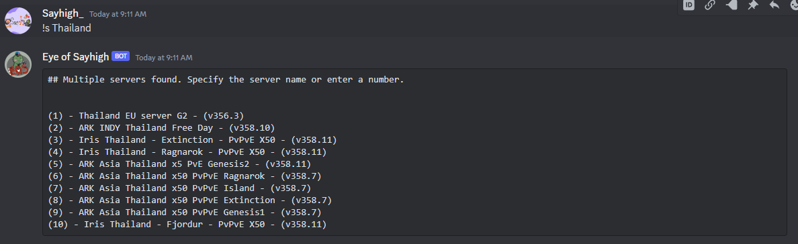

# Eye of Sayhigh

Discord Ark Bot is a Discord bot created to simplify playing the game Ark: Survival Evolved. It features capabilities to fetch player data and inspect profiles on your server.

## Features

- Server Discovery: Using the !s command followed by a server name, the bot will search for and display up to 10 server names that closely match the input. Users can then select a server by typing the corresponding number (1-10). Once a server is selected, the bot will display detailed server information, including name, uptime, and Steam IDs of online players.

- ID Lookup: Using the !id command followed by a Steam64 ID, the bot will retrieve and display information associated with the given Steam64 ID.

## Usage

- !s (server name)
- !id (SteamID64)

### Contact me

DISCORD : sayhigh0010
 
